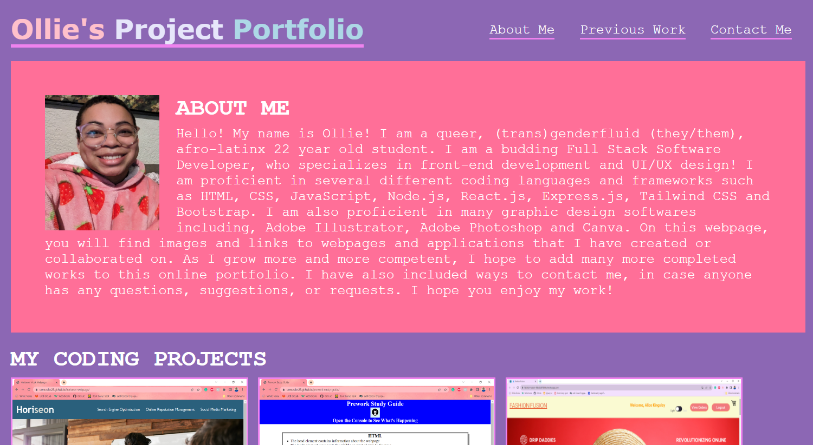

  
  # Coding Portfolio

  ## Table of Contents
  * [Description](#description)
  * [Installation](#installation)
  * [Email](#email)
  * [Github](#github)
  * [License](#license)

  ## Description
  A simple, pink-themed, HTML-based portfolio, featuring my previous coding work and methods to reach me. 

  

  ## Installation
  Click the link in this ReadMe to open the webpage in your browser.

  ## Link To Portfolio
  [Click here to open the portfolio](https://otmorales23.github.io/pink-coding-portfolio/)

  ## Email
  If you have any questions please don't hesitate to reach out to me via email at oliverwills0227@gmail.com

  ## GitHub
  [Click here to see my GitHub profile](https://github.com/otmorales23)

  
  ## License 
    This project is licensed with MIT